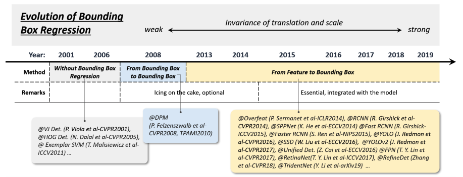
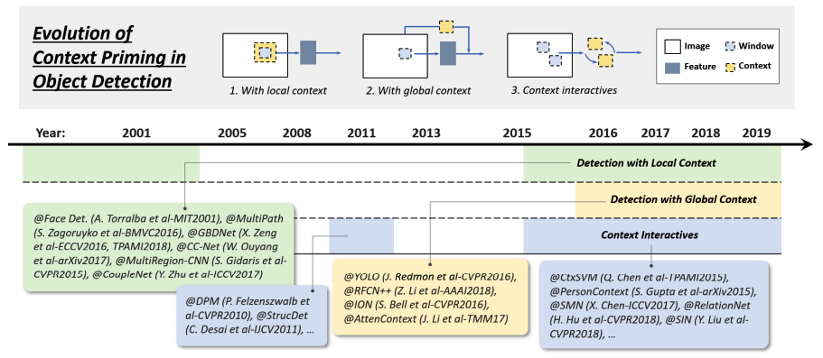
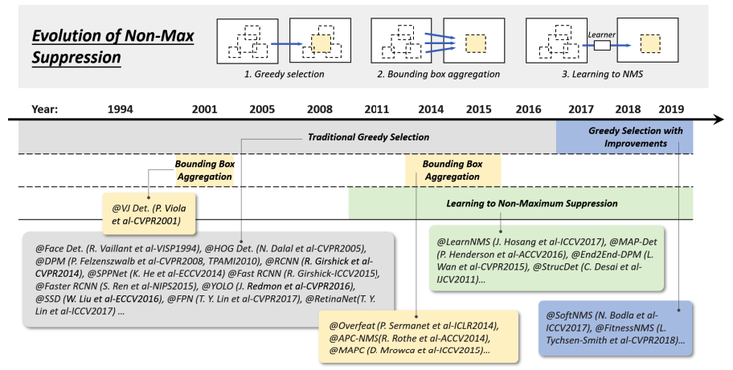
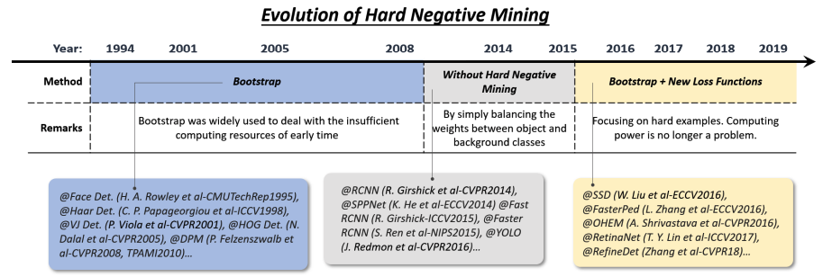
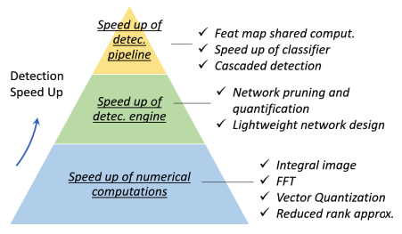
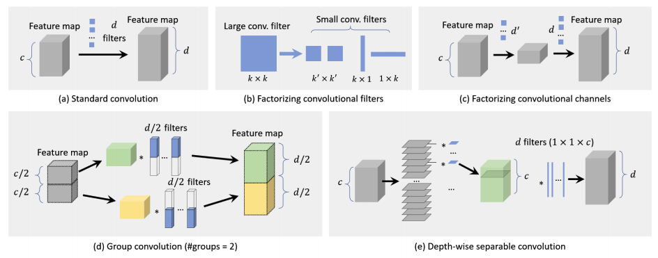

# Computer Vision - Object Detection
### All the papers are sorted in descending order by publication/submission date

## 1. Dataset
- Open Images Dataset (OID2018~) [[link]](https://opensource.google/projects/open-images-dataset)
- MS-COCO (2014, 2015, 2017) [[link]](http://cocodataset.org/#home)
- ImageNet Large Scale Visual Recognition Challenge (ILSVRC 2010~2017) [[link]](http://www.image-net.org/challenges/LSVRC/)
- Pascal VOC (VOC2005~VOC2012) [[link]](http://host.robots.ox.ac.uk/pascal/VOC/)

## 2. Metrics
- Intersection over Union (IoU)
- Mean Average Precision (mAP)
- False Positives Per Image (FPPI)
- False Positives Per Window (FPPW)

## 3. Detectors
* ### 3.1. CNN based One-stage Detectors
 - TridentNet [[paper]](https://arxiv.org/pdf/1901.01892.pdf)
 - RefineDet [[paper]](https://arxiv.org/pdf/1711.06897.pdf)
 - RetinaNet [[paper]](https://arxiv.org/pdf/1708.02002.pdf)
 - Single Shot MultiBox Detector (SSD) [[paper]](https://arxiv.org/pdf/1512.02325.pdf)
 - You Only Look Once (YOLO) [[paper]](https://arxiv.org/pdf/1506.02640.pdf)

* ### 3.2. CNN based Two-stage Detectors
 - Feature Pyramid Networks (FPN) [[paper]](https://arxiv.org/pdf/1612.03144.pdf)
 - Faster R-CNN [[paper]](https://arxiv.org/pdf/1506.01497.pdf)
 - Fast R-CNN [[paper]](https://arxiv.org/pdf/1504.08083.pdf)
 - SPP-net [[paper]](https://arxiv.org/pdf/1406.4729.pdf)
 - R-CNN [[paper]](https://arxiv.org/pdf/1311.2524.pdf)

* ### 3.3. Traditional Detectors
 - Deformable Part-based Model (DPM) [[paper]](https://ieeexplore.ieee.org/document/5255236)
 - HOG Detector [[paper]](https://ieeexplore.ieee.org/document/1467360)
 - Viola Jones Detectors [[paper]](https://ieeexplore.ieee.org/document/990517)

## 4. Consideration
* ### 4.1. Technical Evolution in Object Detection
 * #### 4.1.a. Multi-Scale Detection
 
   - Multi-reference/-resolution detection (2015~)
   - Deep regression (2013~2016)
   - Detection with object proposals (2010~2015)
   - Feature pyramids + sliding windows (~2014)
 * #### 4.1.b. Bounding Box Regression
 
   - From features to BB (2013~)
   - From BB to BB (2008~2013)
   - Without BB regression (~2008)
 * #### 4.1.c. Context Priming
 
   - Context interactive
   - Detection with global context
   - Detection with local context
 * #### 4.1.d. Non-Maximum Suppression (NMS)
 
   - Learning to NMS
   - BB aggregation
   - Greedy selection
 * #### 4.1.e. Hard Negative Mining (HNM)
 
   - Bootstrap + New Loss Functions
   - Weight-balancing
   - Bootstrap

* ### 4.2. Speed-Up Techniques

 * #### 4.2.a. Detection Pipeline
   * ##### 4.2.a.1. Feature Map Shared Computation
     - Spatial Computational Redundancy : Feature map shared computation
     - Scale Computational Redundancy : Scale features rather than the images, Detector pyramid
   * ##### 4.2.a.2. Speed up of Classifier
     - Model approximation
     - Sparse encoding method
   * ##### 4.2.a.3. Cascaded Detection
 * #### 4.2.b. Detection Engine
   * ##### 4.2.b.1. Network Pruning and Quantification
     - Network Pruning : Pruning network structure or weight to reduce its size
     - Network Quantification : Reducing code-length of activations or weights
     - Network Distillation : compress the knowledge of large network into small network
   * ##### 4.2.b.2. Lightweight Network Design
   
     - Factorizing Convolutions : Factorizing convolutional filters/channels
     - Group Convolution
     -
  * #### 4.2.c. Numerical Computations

## Reference
- Object Detection in 20 Years: A Survey [[paper]](https://arxiv.org/pdf/1905.05055.pdf)
